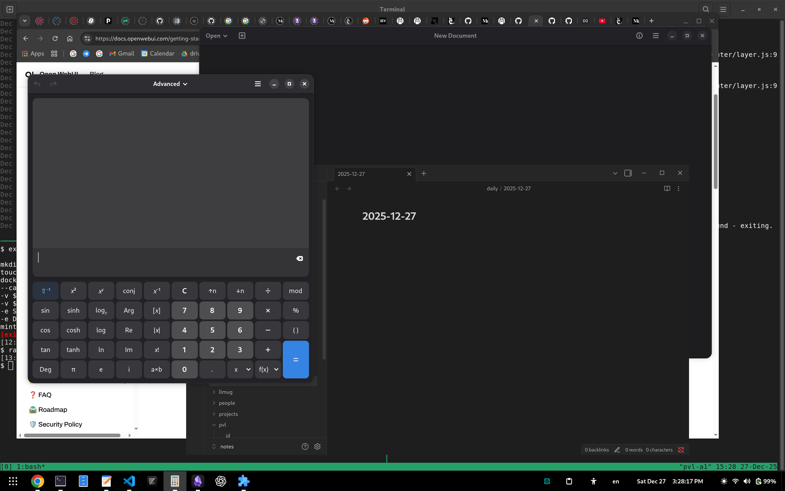
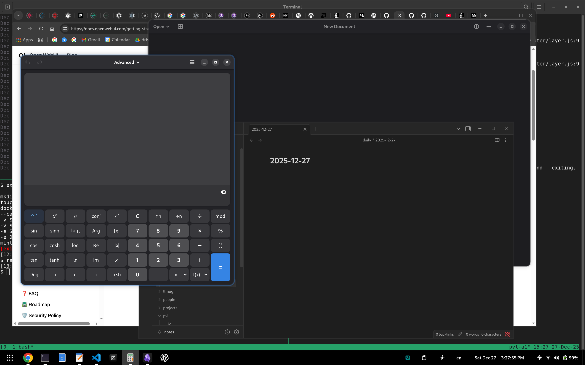
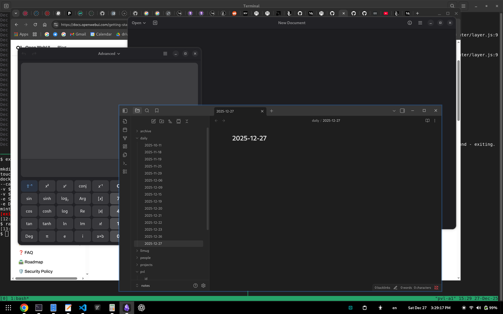
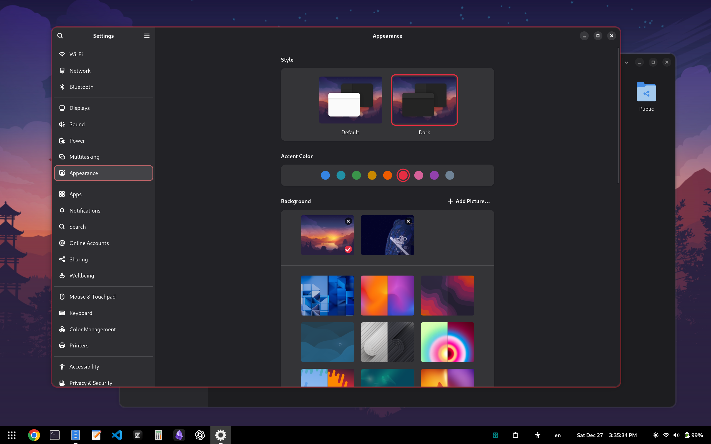
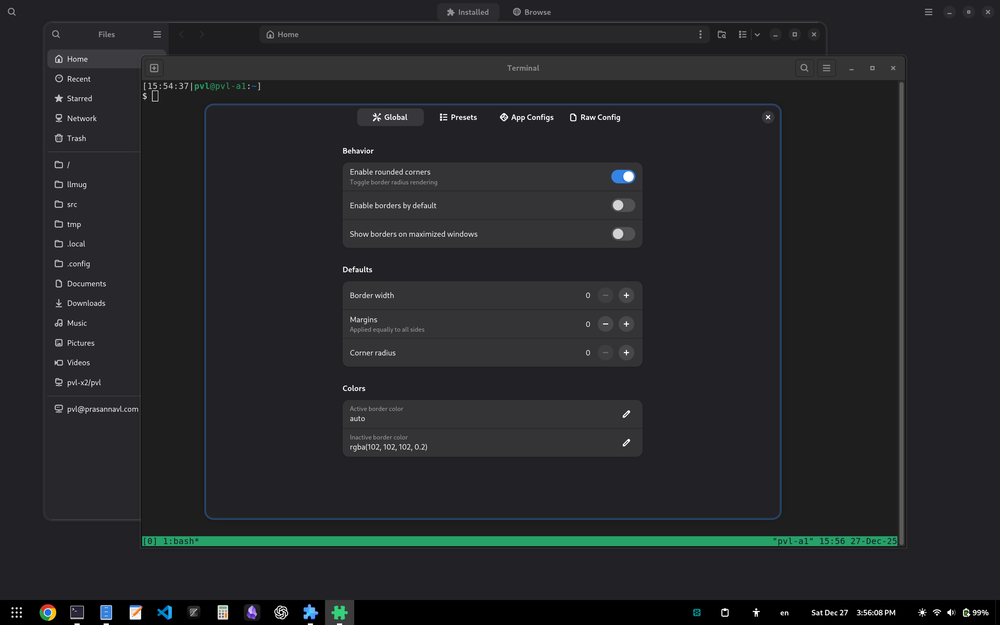
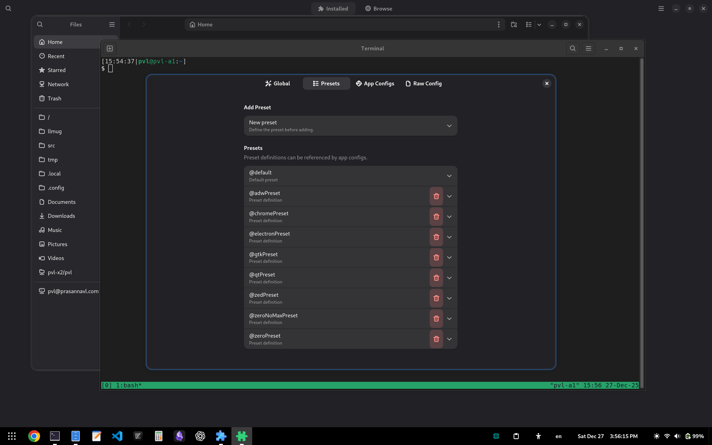
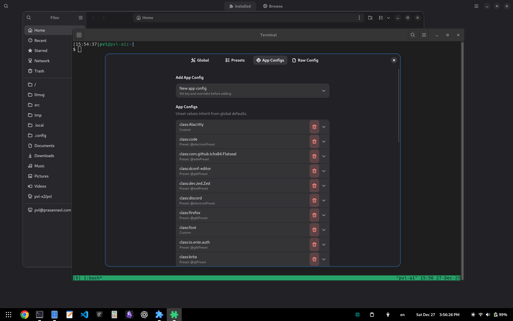

# P7 Borders (GNOME Shell extension)

Add per-window borders in GNOME Shell with per-side margins, per-corner radii,
and edge-aware hiding. Borders are attached to each window actor and updated
efficiently with cached inline styles.

- Compatibility: GNOME Shell 48+.
- Best effort compatibility: GNOME Shell 45+.
- Extension Store:
  https://extensions.gnome.org/extension/9064/p7-window-borders/
- Project is also a Nix flake for direct install on NixOS.

## Features

- Per-window border as a child of `Meta.WindowActor` drawn as efficiently as
  possible in mutter.
- Inner/outer margins, per-side margins, per-corner radius
- Edge-aware hiding (borders drop where windows touch workarea edges)
- Per-app configuration via `gtk-application-id` or `WM_CLASS`
- Style updates are cached to avoid redundant `set_style()` calls
- Uses accent colors by default.
- Works with a whitelist. See [FAQ](#faq).

## Screenshots

<table>
  <tr>
    <td></td>
    <td></td>
  </tr>
  <tr>
    <td></td>
    <td></td>
  </tr>
  <tr>
    <td></td>
    <td></td>
  </tr>
  <tr>
    <td></td>
  </tr>
</table>

## Install

For a local install:

```sh
make install
make enable
```

## Configuration

Settings are stored in GSettings schema `org.gnome.shell.extensions.p7-borders`.

### Global defaults

Global defaults apply when no app-specific override exists:

- `default-enabled` (bool)
- `default-width` (int)
- `default-margins` (int, applied to all sides)
- `default-radius` (int, applied to all corners)
- `default-active-color` (string, `auto` uses GNOME accent)
- `default-inactive-color` (string)
- `default-maximized-borders` (bool)
- `radius-enabled` (bool)
- `modal-enabled` (bool)

### App configs (JSON)

App configs live in the `app-configs` JSON setting. Keys match by:

- `app:ID` for `gtk-application-id`
- `class:WM_CLASS` for `WM_CLASS`
- `regex.app:...` or `regex.class:...` for regex matches
- Presets use keys starting with `@` and can be referenced by name

Each config can define:

- `enabled` (bool)
- `width` (int)
- `margins` (number or `{ top, right, bottom, left }`)
- `radius` (number or `{ tl, tr, br, bl }`)
- `activeColor` / `inactiveColor` (string)
- `maximizedBorder` (bool)

Example `app-configs` JSON:

```json
{
  "@gtkPreset": {
    "margins": { "top": -22, "right": -25, "bottom": -28, "left": -25 },
    "radius": { "tl": 10, "tr": 10, "br": 0, "bl": 0 }
  },
  "@default": { "width": 3 },
  "class:org.gnome.Terminal": "@gtkPreset",
  "class:foot": { "margins": { "top": 27 }, "maximizedBorder": true }
}
```

## Development

Useful Make targets:

- `make lint` - run Biome on `*.js`
- `make schemas` - compile GSettings schema
- `make pack` - build zip into `dist/`
- `make install` - build and install
- `make enable` / `make disable` / `make reload`
- `make clean`

## FAQ

### My application does not have borders. Why?

This default for this extension is to use an opt-in model (Can be changed). Only
apps that match an entry in `app-configs` get borders, so anything not in the
whitelist stays unmodified. This avoids unintended borders on apps where
client-side decorations or insets would look wrong.

### How do I add config so that an application gets borders?

Add an entry to the `app-configs` JSON keyed by `gtk-application-id` or
`WM_CLASS`, then set margins and radius as needed. Example:

```json
{
  "app:org.gnome.Nautilus": { "margins": 6, "radius": 8 },
  "class:org.gnome.Terminal": {
    "margins": { "top": 6, "right": 6, "bottom": 6, "left": 6 }
  },
  "regex.class:org.gnome.*": {
    "margins": { "top": 6, "right": 6, "bottom": 6, "left": 6 }
  }
}
```

### Why use a default opt-in model instead of enabling borders everywhere?

Mutter does not support server-side decorations. And due to this mutter always
asks apps to force themselves to CSD. This results in each app and toolkit with
it's own way of drawing borders and uses margins. This is not ideal to determine
where the border should be drawn. Other WM's like Sway, i3, etc supports SSD and
make this more deterministic. However, this is very in-deterministic and causes
problems in determining where in the mutter's client buffer we should draw the
border.

By opt-in, we workaround these misaligned insets and lets us tune per-app
margins and radii where they make sense. There are common presets where apps
follow known toolkit standards. This for example is applied for `@gtkPreset`,
`@adwPreset`, `@electronPreset` etc.

### Why are my Chrome (or Chromium, Chrome Apps) borders off?

The current default preset works with Chrome's native and Qt mode. If you use
Gtk, then the border preset needs switching to `chromeGtkPreset` for both chrome
and chrome apps. Chrome adds it's own borders and doesn't have consistent
borders across all 3 modes.

The json config:

```
# default 
"regex.class:^google-chrome*": "@chromePreset",
"regex.class:^chrome-*": "@chromePreset",
"regex.class:^chromeium*": "@chromePreset",
```

Switch to:

```
# default 
"regex.class:^google-chrome*": "@chromeGtkPreset",
"regex.class:^chrome-*": "@chromeGtkPreset",
"regex.class:^chromium*": "@chromeGtkPreset",
```

The preset is already provided. Simply use the extension preferences to switch
preset for the above.

### How do I reset all settings?

You can reset all settings to their default values using the `dconf` command:

```bash
dconf reset -f /org/gnome/shell/extensions/p7-borders/
```

Disable and enable the extension and it will auto populate defaults into dconf
again.
