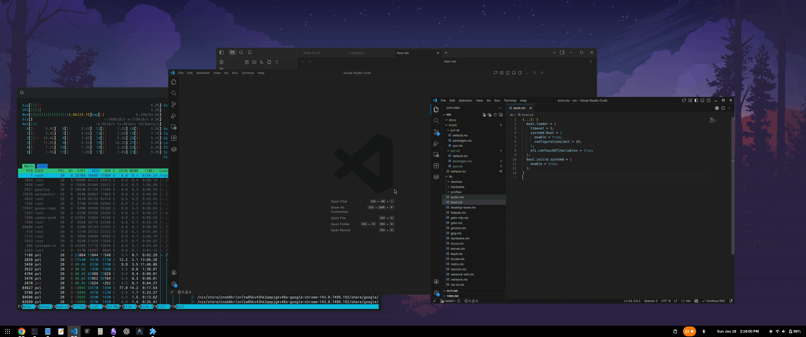
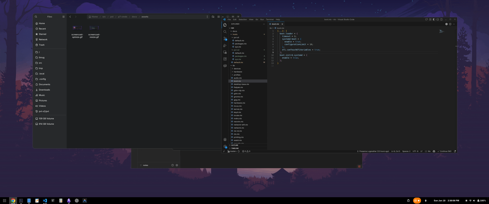
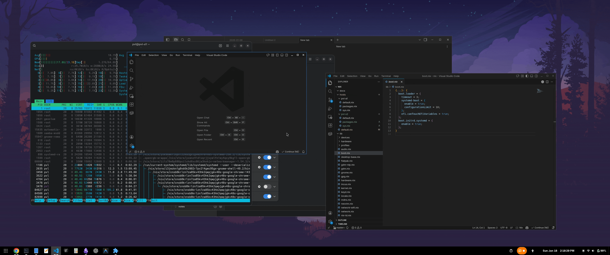
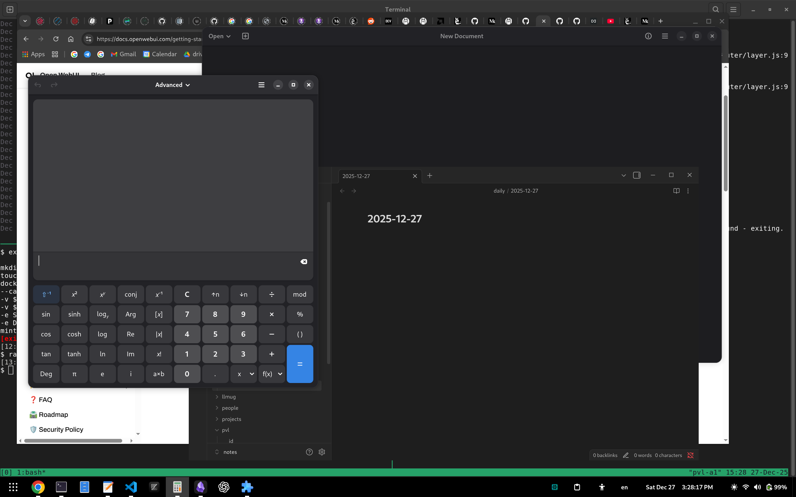
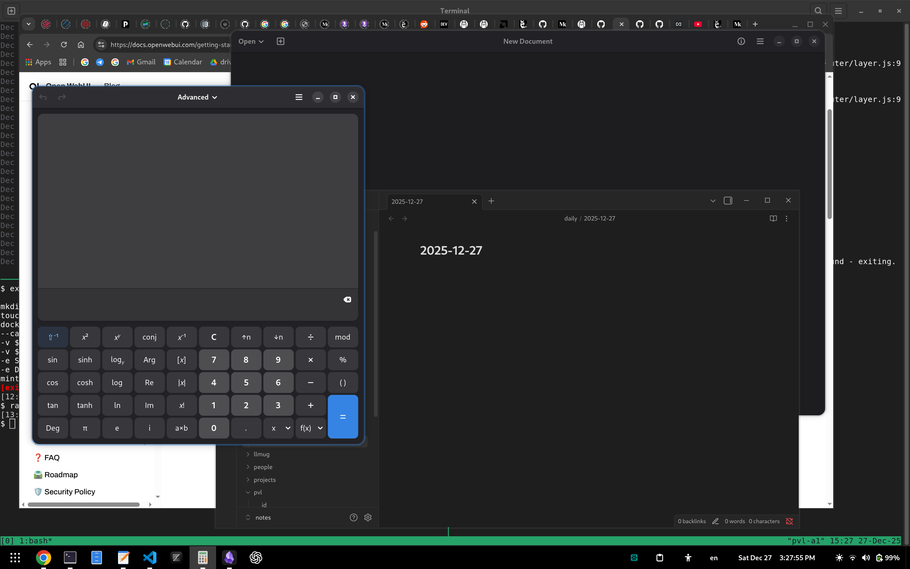
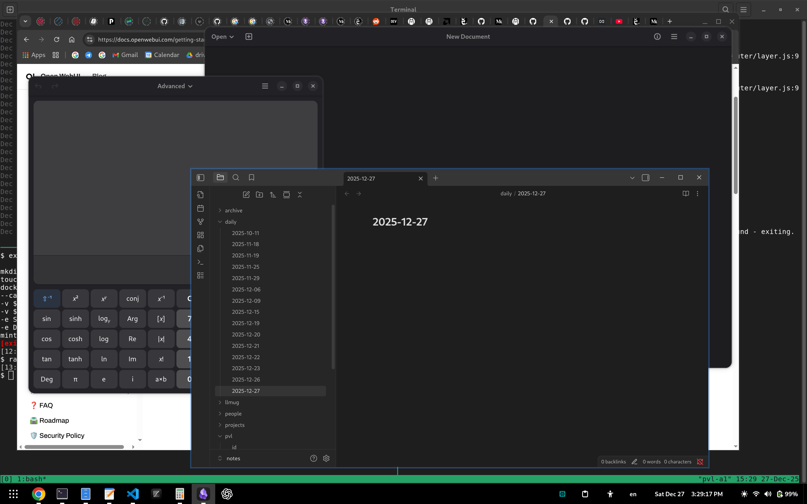
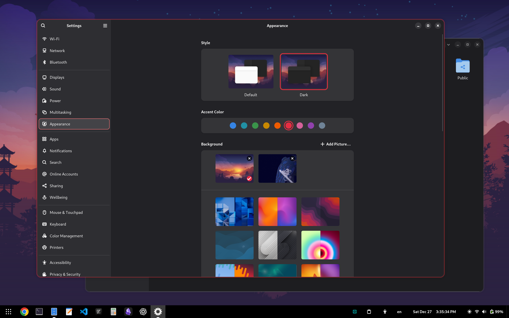
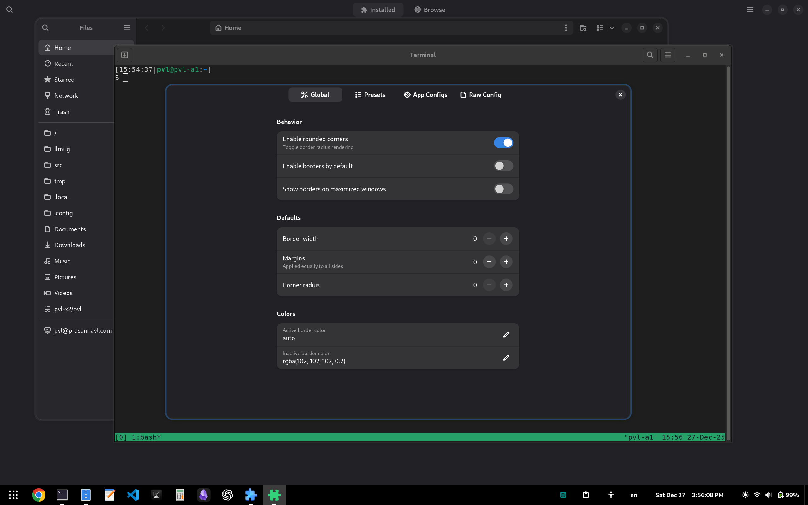
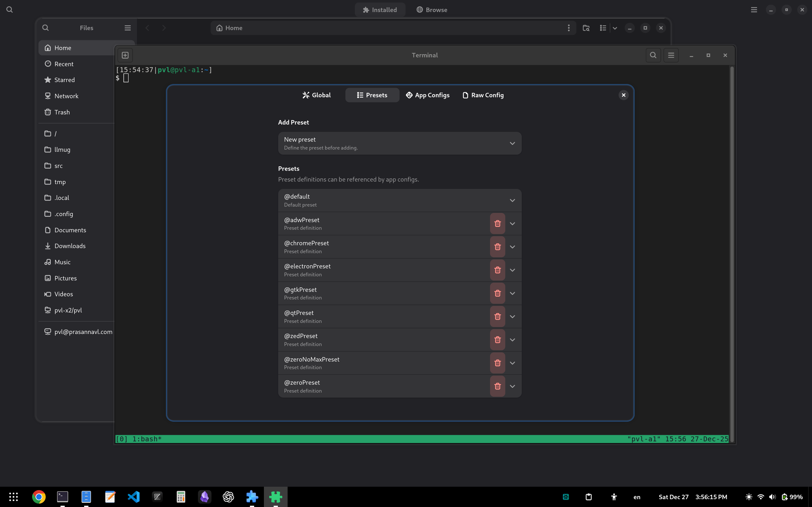
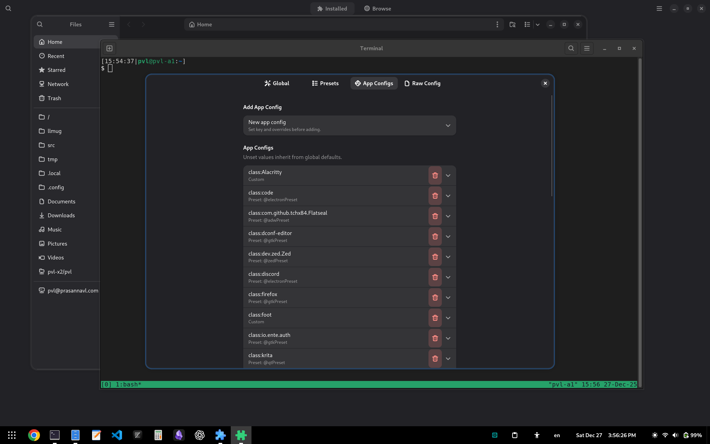

# p7 Borders

Add per-window borders in GNOME Shell with per-side margins, per-corner radii,
and edge-aware hiding. Makes mutter attach borders to each window actor
efficiently with cached inline styles in the compositor.

- Compatibility: GNOME Shell 49+.
- Best effort compatibility: GNOME Shell 45+.
- Extension Store:
  https://extensions.gnome.org/extension/9064/p7-window-borders/
- Project is also a Nix flake for direct install on NixOS.

## Features

- Per-window border as a child of `Meta.WindowActor` drawn efficiently in mutter
  with all the work done in compositor during the compositing phase.
- Inner/outer margins, per-side margins, per-corner radius
- Edge-aware hiding (borders drop where windows touch workarea edges)
- Per-app configuration via `gtk-application-id` or `WM_CLASS`
- Style updates are cached to avoid redundant `set_style()` calls
- Uses accent colors by default.
- Works with a whitelist. See [FAQ](#faq).

## Screencasts

<p align="center">
  
  <br/>
  Comparison with default GNOME
</p>

<p align="center">
  
  <br/>
  Edge-aware smart borders so it doesn't cause bleed effect in multi-monitors
</p>

<p align="center">
  
  <br/>
  Efficiently layered to the windows, natural moves.
</p>

<p align="center">
  
  <br/>
  Natural resizes, letting the compositor do all the work
</p>

## Screenshots

<table>
  <tr>
    <td></td>
    <td></td>
  </tr>
  <tr>
    <td></td>
    <td></td>
  </tr>
  <tr>
    <td></td>
    <td></td>
  </tr>
  <tr>
    <td></td>
  </tr>
</table>

## Install

For a local install:

```sh
nix develop
make ginstall

Log out, login again and enable.
```

## Configuration

Settings are stored in GSettings schema `org.gnome.shell.extensions.p7-borders`.

### Global defaults

Global defaults apply when no app-specific rule exists:

- `default-enabled` (bool)
- `default-width` (int)
- `default-margins` (int, applied to all sides)
- `default-radius` (int, applied to all corners)
- `default-active-color` (string, `auto` uses GNOME accent)
- `default-inactive-color` (string)
- `default-maximized-borders` (bool)
- `radius-enabled` (bool)
- `modal-enabled` (bool)
- `verbose-logging` (bool)
- `use-shipped-configs` (bool)

### App configs (JSON)

The extension keeps its shipped config as a read-only base and stores only user
changes in the `rules` JSON setting. This means new shipped apps and preset
improvements appear on upgrade without replacing custom settings. Preferences
provides both the editable **User Rules** JSON and the read-only **Effective
Config** produced after merging both layers. The effective config can also be
imported or exported as a JSON file.

Disable **Use shipped app configs** on the Global page to evaluate the same user
rules against an empty base. In this mode, shipped presets and app entries are
completely excluded; only your non-null rules become effective. Switching the
option back on restores the shipped base without rewriting your rules.

Keys match by:

- `app:ID` for `gtk-application-id`
- `class:WM_CLASS` for `WM_CLASS`
- `regex.app:...` or `regex.class:...` for regex matches
- Presets use keys starting with `@` and can be referenced by name

Each config can define:

- `enabled` (bool)
- `width` (int)
- `margins` (number or `{ top, right, bottom, left }`)
- `radius` (number or `{ tl, tr, br, bl }`)
- `activeColor` / `inactiveColor` (string)

Rule objects merge recursively with their shipped values. `null` removes a
nested field, while a top-level `null` suppresses a shipped app or preset.
Custom keys are added normally. Example `rules` JSON:

```json
{
  "@gtkPreset": {
    "radius": { "tl": 12, "tr": 12 }
  },
  "class:org.gnome.Terminal": { "width": 4 },
  "class:foot": null,
  "class:my-terminal": { "margins": { "top": 27 } }
}
```

## Development

Useful Make targets:

- `make lint` - run linters
- `make test` - run configuration, border policy, GNOME compatibility,
  GSettings, metadata, schema, and package tests
- `make test-versions` - run standalone GJS configuration and compatibility
  tests with GNOME Shell 45 through 50 dependencies
- `make fmt` - run formatters
- `make schemas` - compile GSettings schema
- `make pack` - build zip into `dist/`
- `make ginstall` - build and install using `gnome-extensions`
- `make install` - Manually install into `DESTDIR` dir
- `make enable` / `make disable` / `make reload`
- `make clean`

## FAQ

### My application does not have borders. Why?

This default for this extension is to use an opt-in model (Can be changed). Only
apps that match an effective app config get borders, so anything not in the
whitelist stays unmodified. This avoids unintended borders on apps where
client-side decorations or insets would look wrong.

### Tips for GNOME 45-48

- Turn on `Enable by default` in preferences.

The shipped config and presets are tuned for GNOME 49+, so on older versions
many common windows may not be covered by the default app list. GNOME also uses
Adw more consistenly and with wmclass names org.gnome.* in GNOME 49+, so we only
ship those for default config. You can always add the apps you want to the
whitelist config or just live with the small default set that's already covered,
but enabling just makes for a slightly better experience. The disadvantage is
that we might not have nicely rounded borders that match the windows for these
windows.

### How do I add config so that an application gets borders?

Use **Quick Add** on the App Configs preferences page, choose the identifier
type, enter its value, and press Enter. You can then expand the new row to
select a preset or set margins and radius. The same entries can be written in
the User Rules JSON, keyed by `gtk-application-id` or `WM_CLASS`. Example:

```json
{
  "app:org.gnome.Nautilus": { "margins": 6, "radius": 8 },
  "class:org.gnome.Terminal": {
    "margins": { "top": 6, "right": 6, "bottom": 6, "left": 6 }
  },
  "regex.class:org.gnome.*": {
    "margins": { "top": 6, "right": 6, "bottom": 6, "left": 6 }
  }
}
```

### Why use a default opt-in model instead of enabling borders everywhere?

Mutter does not support server-side decorations. And due to this mutter always
asks apps to force themselves to CSD. This results in each app and toolkit with
it's own way of drawing borders and uses margins. This is not ideal to determine
where the border should be drawn. Other WM's like Sway, i3, etc supports SSD and
make this more deterministic. However, this is very in-deterministic and causes
problems in determining where in the mutter's client buffer we should draw the
border.

By opt-in, we workaround these misaligned insets and lets us tune per-app
margins and radii where they make sense. There are common presets where apps
follow known toolkit standards. This for example is applied for `@gtkPreset`,
`@adwPreset`, etc.

### Why are my Chrome (or Chromium, Chrome Apps) borders off?

The current default preset works with Chrome's native and Qt mode. If you use
Gtk, then the border preset needs switching to `@gtkPreset` for both chrome
and chrome apps. Chrome adds it's own borders and doesn't have consistent
borders across all 3 modes.

The json config:

```
# default 
"regex.class:^google-chrome*": "@chromePreset",
"regex.class:^chrome-*": "@chromePreset",
"regex.class:^chromeium*": "@chromePreset",
```

Switch to:

```
# default 
"regex.class:^google-chrome*": "@gtkPreset",
"regex.class:^chrome-*": "@gtkPreset",
"regex.class:^chromium*": "@gtkPreset",
```

The preset is already provided. Simply use the extension preferences to switch
preset for the above.

### How do I reset all settings?

You can reset all settings to their default values using the `dconf` command:

```bash
dconf reset -f /org/gnome/shell/extensions/p7-borders/
```

Disable and enable the extension again. Shipped app defaults remain in the
extension and are not written to dconf.
